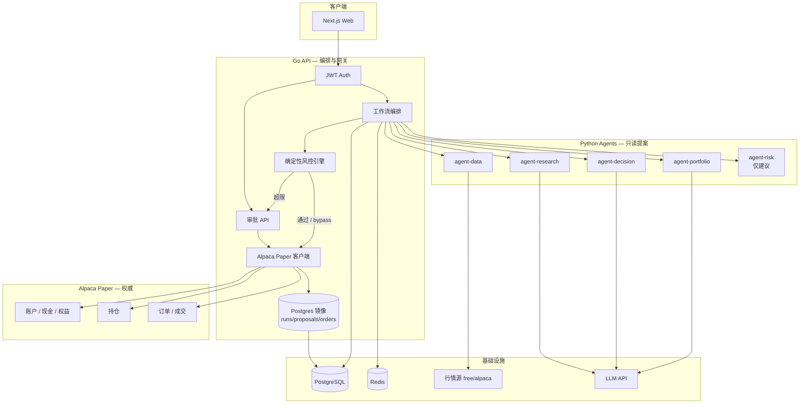
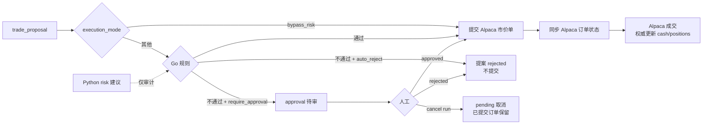
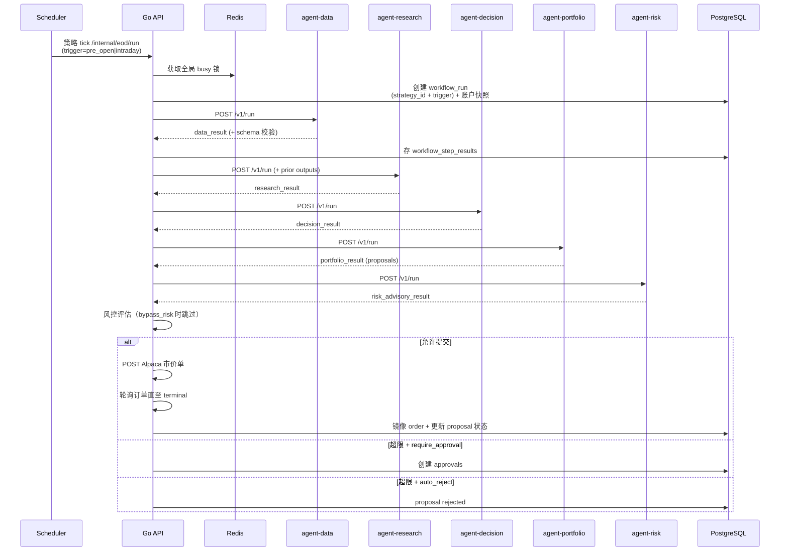

# 策略驱动纸面交易流程图

> 文件名含历史 `eod` 前缀；**产品节奏由激活策略决定**（pre-open / intraday），不是单一日终 cron。

对应设计规格：`docs/superpowers/specs/2026-07-23-us-stock-paper-trading-agents-design.md`（V1 基线）。  
**调度与 Runs 可观测性**：`docs/superpowers/specs/2026-07-28-strategy-scheduler-runs-observability-design.md`（**取代** V1「仅 EOD」节奏）。  
**现金 / 持仓 / 订单权威**：`docs/superpowers/specs/2026-07-28-alpaca-paper-authority-design.md`（Phase 1 已落地）。

## 策略驱动调度与 execution_mode

- **Cadence**：由当前**激活策略**决定。默认含 **pre-open**（常规开盘前，如 09:20 ET）与 **intraday**（盘中定时，如 10:00–15:00 每小时）两类触发；调度器随策略切换热重载。无激活策略时**不注册**自动 tick。
- **手动触发**：Web「Run now」→ `POST /api/v1/runs/eod`（路径名为历史遗留）；`trigger=manual`，并挂上当前激活 `strategy_id`（若有）。
- **`require_approval`**：Go 风控超限 → 创建 approval；人工 `approved` 后向 Alpaca Paper 提交订单。
- **`auto_reject_breaches`**：Go 风控超限**不创建** approval，提案直接 `rejected`；无其余待审项时 run 仍可终态为 `executed`。
- **`bypass_risk`**：跳过 Go 风控；可执行提案直接向 Alpaca Paper 提交市价单。

## 1. 系统总览



信任边界：

- Agents **永不**调用 Alpaca Trading API，也不写入现金 / 持仓 / 订单。
- **Alpaca Paper** 为现金、持仓、订单与成交价的权威；Go API 是唯一与 Alpaca Trading 交互的组件。
- Go 在风控通过、`bypass_risk` 或审批 `approved` 后向 Alpaca 提交市价单；Postgres 仅存 runs / proposals / approvals 及订单镜像（审计）。
- Python Risk 输出仅供审计；Go 规则引擎为最终判定（`bypass_risk` 时跳过）。

## 2. 工作流主流程（策略 tick / 手动）

```mermaid
flowchart TD
  Start([策略调度 pre-open/intraday<br/>或手动 Run now]) --> Lock{Redis 全局 busy 锁}
  Lock -->|获取失败| Abort([跳过 / 已有运行中])
  Lock -->|成功| Create[创建 workflow_run<br/>加载账户快照 + 观察列表]

  Create --> S1[1. agent-data<br/>日线 OHLCV]
  S1 --> S2[2. agent-research<br/>bias / thesis]
  S2 --> S3[3. agent-decision<br/>buy/sell/hold 意图]
  S3 --> S4[4. agent-portfolio<br/>可执行提案 qty/权重/止盈止损]
  S4 --> S5[5. agent-risk<br/>flags / scores / auto|review]

  S5 --> Mode{execution_mode}
  Mode -->|bypass_risk| Submit[向 Alpaca 提交市价单<br/>client_order_id = proposal.id]
  Mode -->|require_approval / auto_reject| Eval[Go 风控逐笔评估<br/>risk_rule_configs]

  Eval --> Split{每笔提案}
  Split -->|全部规则通过| Submit
  Split -->|超限 + auto_reject| Reject[提案 rejected]
  Split -->|超限 + require_approval| Pend[创建 approval<br/>breach_reasons]

  Submit --> Sync[REST 轮询订单状态<br/>直至 terminal 或超时]
  Sync --> Filled[proposal filled / rejected / canceled]
  Reject --> Terminal{是否还有待审批?}
  Pend --> Terminal
  Filled --> Terminal
  Terminal -->|有| Await[run = awaiting_approval]
  Terminal -->|无| Done[run = executed]

  Done --> NAV[可选 NAV 快照<br/>Alpaca 权益]
  Await --> NAV

  S1 -.->|schema/infra 失败| Fail[run = failed<br/>无 Alpaca 提交]
  S2 -.-> Fail
  S3 -.-> Fail
  S4 -.-> Fail
  S5 -.-> Fail
```

步骤状态推进：`created` → `data` → `research` → `decision` → `portfolio` → `risk` → 风控 / 成交或审批。

## 3. 单笔提案：风控与审批



V1 默认规则示例：

| 规则 | 默认 |
|------|------|
| 单笔最大名义金额 | 10000 USD |
| 单票最大权重 | 20% |
| 最低现金比例 | 10% |

允许部分提交：未超限的提案立刻提交 Alpaca，超限提案按模式 reject 或等待审批。成交价以 Alpaca fill 为准，不再使用本地日线 close 作为成交权威。

## 4. Agent 调用链（时序）



## 5. 运行终态

| Run 状态 | 含义 |
|----------|------|
| `awaiting_approval` | 至少一笔提案仍待人工处理（其他可能已成交） |
| `executed` | 无待审；全部提案已成交 / 拒绝 / 取消 |
| `failed` | Agent / 基础设施 / Schema / Alpaca 配置失败；**本 run 无 Alpaca 提交** |
| `cancelled` | 用户取消；待审取消；本 run 已成交保留 |

`rejected` 是审批/提案状态，不是 run 状态。
