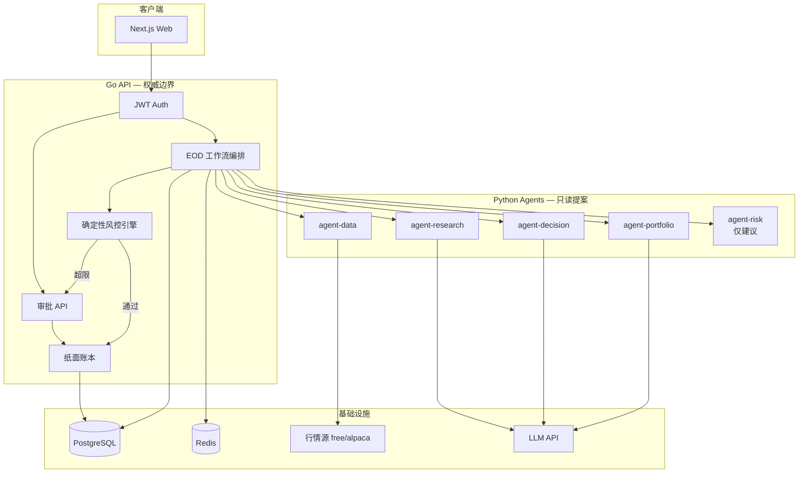
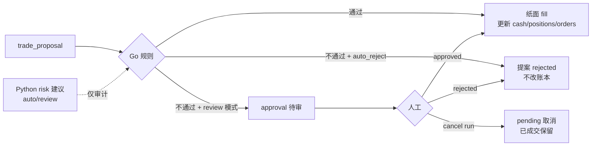
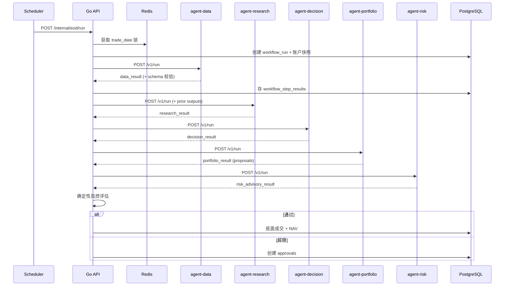

# EOD 纸面交易流程图

对应设计规格：`docs/superpowers/specs/2026-07-23-us-stock-paper-trading-agents-design.md`。策略调度与可观测性见 `docs/superpowers/specs/2026-07-28-strategy-scheduler-runs-observability-design.md`。

## 策略驱动调度与 auto_reject

- **Cadence**：由当前**激活策略**决定，不再依赖固定单一 cron。默认含 **pre-open**（常规开盘前，如 09:20 ET）与 **intraday**（盘中定时，如 10:00–15:00 每小时）两类触发；调度器随策略切换热重载。
- **`auto_reject_breaches`**：当策略 `execution_mode` 为此值时，Go 风控超限**不创建**待审 approval，提案直接标记 `rejected`；无其余待审项时 run 仍可终态为 `executed`（无需人工审批）。

## 1. 系统总览



信任边界：

- Agents **永不**写入现金 / 持仓 / 订单。
- 只有 Go API 在 `auto_execute` 或审批 `approved` 后提交账本变更。
- Python Risk 输出仅供审计；Go 规则引擎为最终判定。

## 2. 日终主流程

```mermaid
flowchart TD
  Start([cron / 手动 Run EOD]) --> Lock{Redis 锁<br/>trade_date}
  Lock -->|获取失败| Abort([跳过 / 已有运行中])
  Lock -->|成功| Create[创建 workflow_run<br/>加载账户快照 + 观察列表]

  Create --> S1[1. agent-data<br/>日线 OHLCV]
  S1 --> S2[2. agent-research<br/>bias / thesis]
  S2 --> S3[3. agent-decision<br/>buy/sell/hold 意图]
  S3 --> S4[4. agent-portfolio<br/>可执行提案 qty/权重/止盈止损]
  S4 --> S5[5. agent-risk<br/>flags / scores / auto|review]

  S5 --> Eval[Go 风控逐笔评估<br/>risk_rule_configs]

  Eval --> Split{每笔提案}
  Split -->|全部规则通过| AutoFill[纸面成交<br/>EOD close 价]
  Split -->|任一规则失败| Pend[创建 approval<br/>breach_reasons]

  AutoFill --> Terminal{是否还有待审批?}
  Pend --> Terminal
  Terminal -->|有| Await[run = awaiting_approval]
  Terminal -->|无| Done[run = executed]

  AutoFill --> NAV[upsert nav_snapshots]
  Done --> NAV
  Await --> NAV

  S1 -.->|schema/infra 失败| Fail[run = failed<br/>无账本写入]
  S2 -.-> Fail
  S3 -.-> Fail
  S4 -.-> Fail
  S5 -.-> Fail
```

步骤状态推进：`created` → `data` → `research` → `decision` → `portfolio` → `risk` → 风控 / 成交或审批。

## 3. 单笔提案：风控与审批



V1 默认规则示例：

| 规则 | 默认 |
|------|------|
| 单笔最大名义金额 | 10000 USD |
| 单票最大权重 | 20% |
| 最低现金比例 | 10% |

允许部分自动成交：未超限的订单立刻 fill，超限订单单独等待审批。

## 4. Agent 调用链（时序）



## 5. 运行终态

| Run 状态 | 含义 |
|----------|------|
| `awaiting_approval` | 至少一笔提案仍待人工处理（其他可能已成交） |
| `executed` | 无待审；全部提案已成交 / 拒绝 / 取消 |
| `failed` | Agent / 基础设施 / Schema 失败；**本 run 无账本写入** |
| `cancelled` | 用户取消；待审取消；本 run 已成交保留 |

`rejected` 是审批/提案状态，不是 run 状态。
